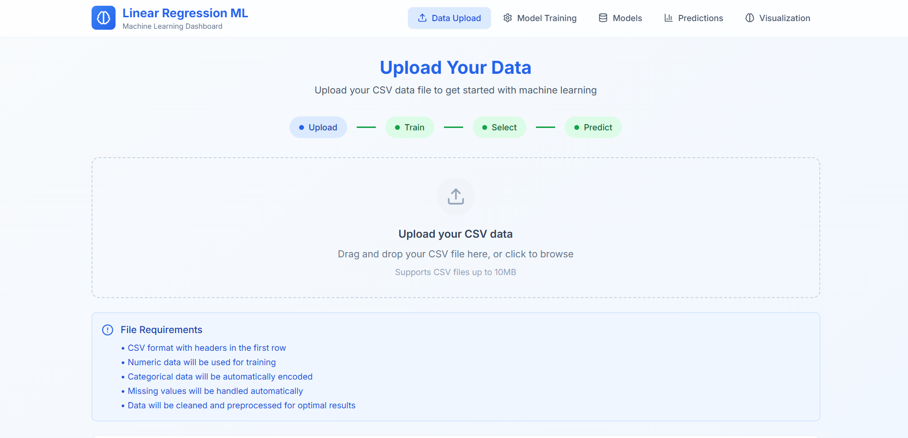

# 🧠 Linear Regression Brain


A powerful, custom implementation of Linear Regression built from scratch using NumPy, wrapped in a modern full-stack application. This project demonstrates the core mathematics of machine learning (Gradient Descent) without relying on high-level ML libraries like scikit-learn for the core tracking logic.

 <!-- You can add a screenshot later -->

## ✨ Features

- **Custom ML Engine (`Brain` class)**: 
  - Implements Linear Regression using **Gradient Descent** from first principles.
  - Custom `forward`, `loss` (MSE), and `gradient` calculation methods.
  - Supports multi-variate regression with automatic feature scaling/normalization.
  
- **Robust Data Pipeline**:
  - **Comprehensive Cleaning**: Automatically handles missing values, outliers, and categorical encoding.
  - **Numpy Compatibility**: Ensures all data is strictly numeric before entering the compute graph.
  
- **Model Management System**:
  - Train, save, load, and delete multiple model instances.
  - Versioning with metadata (training date, hyperparams, accuracy).
  - Export models as ZIP packages.

- **Interactive Frontend**:
  - React + Vite powered UI.
  - Real-time training visualization.
  - Drag-and-drop CSV upload.
  - Dynamic prediction interface.

## 🛠️ Tech Stack

### Backend
- **FastAPI**: High-performance Async API.
- **NumPy**: The core "Brain" for matrix operations and calculus.
- **Pandas**: Data manipulation and cleaning.

### Frontend
- **React 18**: Component-based UI.
- **Vite**: Next-generation frontend tooling.
- **TailwindCSS**: Utility-first styling.
- **Recharts**: Data visualization.

## 🚀 Getting Started

### Prerequisites
- Python 3.9+
- Node.js 16+

### 1. Backend Setup

```bash
# Clone the repository
git clone <repository-url>
cd project1

# Create virtual environment (optional but recommended)
python -m venv venv
# Windows
.\venv\Scripts\activate
# Mac/Linux
source venv/bin/activate

# Install dependencies
pip install -r requirements.txt

# Run the server
uvicorn main:app --reload
```

The API will be available at `http://localhost:8000`.

### 2. Frontend Setup

Open a new terminal:

```bash
cd frontend

# Install dependencies
npm install

# Run the development server
npm run dev
```

The UI will be available at `http://localhost:5173`.

## 📘 API Documentation

Once the backend is running, visit `http://localhost:8000/docs` for the interactive Swagger UI.

### Key Endpoints
- `POST /upload`: Upload and clean CSV data.
- `POST /train`: Train a new model on uploaded data.
- `GET /models`: List all saved models.
- `POST /predict`: Make predictions using the active model.

## 🧠 math inside `Brain`

The core logic resides in `brain.py`. It uses the Mean Squared Error (MSE) cost function:

$$ J(\theta) = \frac{1}{m} \sum_{i=1}^{m} (h_\theta(x^{(i)}) - y^{(i)})^2 $$

And updates weights using Gradient Descent:

$$ \theta_j := \theta_j - \alpha \frac{\partial}{\partial \theta_j} J(\theta) $$

## 📦 Deployment

### Backend (Render)
This project is configured for [Render](https://render.com).
1. Connect your repo to Render.
2. Select "Web Service".
3. Use the `render.yaml` configuration or set:
   - **Build Command**: `pip install -r requirements.txt`
   - **Start Command**: `uvicorn main:app --host 0.0.0.0 --port $PORT`

### Frontend (Vercel)
1. Import the `frontend` directory into Vercel.
2. The `vercel.json` ensures client-side routing works correctly.
3. Add environment variable `VITE_API_URL` pointing to your Render backend URL.

## 📄 License

MIT License - feel free to use this "Brain" for your own learning!
